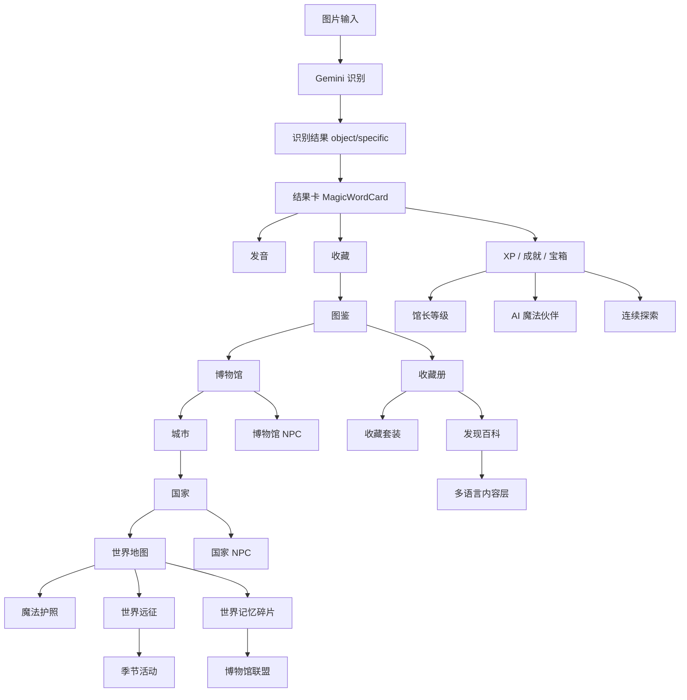

# AI魔法识字相机

# 项目开发手册（阶段总结版）

覆盖版本：

`v0.52-world-exploration`
→
`v0.62-multilanguage-content`

## 1. 项目定位

AI魔法识字相机是一款面向儿童的 AI 视觉识字与探索成长应用。

核心体验是：

1. 用户拍照或选择图片。
2. AI 识别现实世界中的物体。
3. App 将物体转化为可收藏、可发音、可探索的“魔法藏品”。
4. 藏品进入图鉴、博物馆、城市、国家、世界探索体系。
5. 孩子在持续发现中获得成长感、陪伴感、任务感和世界文明启蒙。

产品方向：

- 儿童友好
- 魔法沉浸感
- 世界探索感
- 博物馆式知识启蒙
- 多语言学习基础设施

## 2. Phase 1 核心识别系统

Phase 1 建立了从图片到识别结果的 MVP 闭环。

已完成能力：

- Expo React Native App
- TypeScript
- Expo Router
- 图片选择与拍照入口
- 前端上传图片到后端
- FastAPI 后端识别接口
- Gemini Vision 识别
- 识别结果结构化返回
- 前端显示识别结果卡
- 中英文发音按钮
- 图片预览
- 失败提示
- 临时服务异常提示
- Follow-up Recognition 追问识别
- Precision Recognition 精准识别字段

核心原则：

- `object_zh` / `object_en` 继续作为图鉴匹配基础字段。
- `specific_zh` / `specific_en` 用于更具体的展示。
- Gemini 和后端接口保持稳定，前端逐步增强体验。

## 3. Phase 2 博物馆世界

Phase 2 将单次识别扩展为收藏与博物馆体系。

已完成能力：

- 图鉴系统
- 收藏系统
- 博物馆内容库
- 藏品故事
- 博物馆进度联动
- 我的图鉴 Collection Gallery
- 藏品详情页 ArtifactDetailModal
- 稀有度视觉升级
- 博物馆探索页 Museum Explorer
- 博物馆 NPC 馆长角色
- 魔法收藏册 Museum Collections Book
- 发现百科 Discovery Encyclopedia

核心结构：

- 藏品属于博物馆。
- 博物馆根据收藏进度点亮。
- 已发现藏品可查看详情、故事、发音、分享。
- 未发现藏品保持神秘感，引导继续探索。

## 4. Phase 3 世界探索

Phase 3 将博物馆拓展为城市、国家与世界地图。

已完成能力：

- World Magic Map 世界地图
- City Unlock Reward 城市点亮奖励
- World Explorer Achievement 世界探索成就
- Visual World Map 世界地图视觉升级
- Museum Travel Passport 魔法护照
- National Map 国家地图
- Museum Explorer 博物馆探索页

世界探索逻辑：

- 藏品完成度推动博物馆完成度。
- 博物馆完成度推动城市完成度。
- 城市完成度推动国家完成度。
- 国家完成度推动世界探索完成度。

当前地图不使用地图 SDK，不依赖真实地图 API，以卡片式探索地图实现。

## 5. Phase 4 长期成长体系

Phase 4 建立长期留存与成长身份。

已完成能力：

- XP 成长系统
- 等级系统
- 连续探索 streak
- 宝箱系统
- 成就系统
- Daily Quest 每日任务
- Limited Event 限定活动
- AI 魔法伙伴养成系统
- Museum Master Rank 馆长等级体系
- Magic Storyline 魔法主线剧情
- World Expedition 世界远征任务
- Discovery Celebration 新发现庆典
- Magic Guild 探索者公会
- Daily Discovery Streak 每日连续探索

长期成长目标：

- 让孩子知道“我今天还能探索什么”。
- 让每次新发现有仪式感。
- 让长期回访有连续性。
- 让身份从普通探索者逐步成长为馆长、世界探索者。

## 6. Phase 5 世界文明体系

Phase 5 将内容从基础物体扩展为世界文明、艺术、自然和生活类知识。

已完成能力：

- World Museum Expansion 第一批国家扩展
- World Museum Content Localization 世界博物馆内容扩展
- National NPC Expansion 国家专属 NPC
- Seasonal Events 世界季节活动
- World Memory Fragments 世界记忆碎片
- Magic Museum League 魔法博物馆联盟
- Museum Collection Sets 博物馆收藏套装
- Discovery Encyclopedia 发现百科

已覆盖国家扩展：

- 中国
- 日本
- 美国
- 法国
- 英国
- 意大利
- 西班牙
- 巴西
- 墨西哥
- 埃及
- 印度
- 澳大利亚

内容体系方向：

- 动物
- 自然
- 科技
- 文明
- 艺术
- 世界文化
- 人物职业
- 海洋
- 城市旅行

## 7. Phase 6 全球化基础设施

Phase 6 开始建立全球化能力。

已完成版本：

- `v0.61-global-language-layer`
- `v0.62-multilanguage-content`

v0.61 Global Language Layer：

- 新增全局 UI 国际化架构
- 支持 `zh / en / es / pt / ja`
- 新增 `useLanguage`
- 新增 `LanguageSwitcher`
- 新增 `ai-magic-camera-language`
- 第一版只翻译 UI，不翻译藏品内容和 story

v0.62 Multi-language Museum Content：

- 新增内容语言 helper
- 新增 `useContentLanguage`
- museumArtifacts 增加可选字段：
  - `nameTranslations`
  - `descriptionTranslations`
- 第一批高频藏品支持 5 种语言名称和简介
- 保留 `objectZh / objectEn / story`
- story 和百科正文暂不翻译

## 8. 当前系统架构图

### 项目成长结构图

```text
识别
↓
图鉴
↓
博物馆
↓
城市
↓
国家
↓
国家NPC
↓
联盟
↓
收藏册
↓
收藏套装
↓
百科
↓
世界记忆
↓
远征
↓
季节活动
↓
连续探索
↓
多语言内容
```

### 功能架构图



## 9. 已知技术债务（TD-001~TD-019）

TD-001：`app/index.tsx` 仍然过大，虽然已拆出多批组件和 hooks，但主流程仍承担较多状态协调。

TD-002：部分旧组件中仍有硬编码中文 UI 文案，尚未完全接入 `t()`。

TD-003：多语言内容只覆盖第一批高频藏品，内容库尚未全量翻译。

TD-004：`story` 长篇内容尚未建立多语言版本。

TD-005：NPC 台词尚未进入国际化体系。

TD-006：成就、远征、季节活动等内容数据仍主要是单语言内容。

TD-007：稀有度、博物馆、联盟、套装等内容标签存在 UI 文案和内容数据边界，需要继续梳理。

TD-008：部分状态逻辑依赖 localStorage，缺少统一存储迁移机制。

TD-009：localStorage 数据结构版本管理尚未建立。

TD-010：收藏匹配依赖 aliases 和基础 object 字段，复杂同义词场景仍可能漏匹配。

TD-011：Gemini 返回格式虽然已增强，但前后端 schema 仍缺少共享类型定义。

TD-012：Follow-up Recognition 仍可进一步抽象，避免未来堆回主流程。

TD-013：分享卡 PNG 导出为 Web 优先方案，移动端保存体验尚未完善。

TD-014：世界地图、国家地图、博物馆地图仍为卡片式 UI，后续需要更完整的信息层级设计。

TD-015：部分统计数据依赖多个来源动态计算，缺少统一 dashboard selector。

TD-016：测试主要依赖 TypeScript 和 lint，缺少组件级自动化测试。

TD-017：内容库体量增长后，需要考虑分文件管理和按主题拆分。

TD-018：国际化 key 需要持续规范命名，避免后续重复或语义不清。

TD-019：当前儿童魔法视觉风格主要由内联样式承载，后续可抽出 design tokens。

## 10. BUG清单（BUG-012~BUG-015）

BUG-012：部分终端环境中中文输出可能显示乱码，但文件实际 UTF-8 内容通常正常。

BUG-013：Gemini 偶发 502 / 503 / UNAVAILABLE 时，用户需要更稳定的重试体验和状态提示。

BUG-014：部分新国家或新博物馆如果暂无藏品，UI 需要持续保证 0 / 0 状态不崩溃。

BUG-015：少量识别结果可能落入默认馆，需要持续扩展 aliases 和通用内容库。

## 11. 下一阶段路线图

建议下一阶段目标：

1. v0.63 Product Polish
2. 完成 UI 国际化第一轮查漏
3. 扩展多语言藏品内容覆盖率
4. 梳理首页信息层级
5. 优化公会总部导航
6. 优化新手首次体验
7. 增强失败、重试、加载状态
8. 减少 `app/index.tsx` 剩余复杂度
9. 建立内容库分层管理
10. 准备更稳定的演示版本

## 12. v0.63 Product Polish 规划

v0.63 重点不建议继续堆新系统，而是做产品打磨。

建议范围：

- 首页首屏整理
- 公会总部入口优化
- 识别结果卡视觉统一
- 加载态统一
- 失败态统一
- 返回按钮和导航路径统一
- 多语言切换入口视觉优化
- 未发现藏品提示统一
- 完成度展示统一
- 卡片间距、圆角、阴影规范化
- 核心路径体验回归：
  1. 选择图片
  2. 成功识别
  3. 查看结果卡
  4. 收藏进入图鉴
  5. 查看百科
  6. 打开公会总部
  7. 查看世界进度
  8. 切换语言

v0.63 验收建议：

- `npx tsc --noEmit` 通过
- `npm run lint` 通过
- `npm run web` 不崩溃
- 核心识别链路正常
- 公会总部导航清晰
- 多语言切换后主要 UI 文案能变化
- 藏品内容不丢失

## 版本里程碑

### v0.52-world-exploration

建立世界探索基础，包括世界地图、国家、城市和博物馆进度。

### v0.53-world-expedition

新增世界远征任务，让用户知道下一步应该探索什么。

### v0.54-discovery-celebration

新增新发现庆典，增强第一次发现藏品的仪式感。

### v0.56-world-expansion

扩展世界地图国家、城市、博物馆，并补充世界文明内容。

### v0.57-seasonal-events

新增季节活动，让魔法世界具备时间变化感。

### v0.59-daily-streak

新增每日连续探索系统，建立轻量留存机制。

### v0.60-collection-sets

新增收藏册与收藏套装，让藏品之间形成组合目标。

### v0.61-global-language-layer

建立全局 UI 国际化架构，支持 5 种语言。

### v0.62-multilanguage-content

建立多语言内容层，第一批高频藏品支持名称和简介多语言显示。
